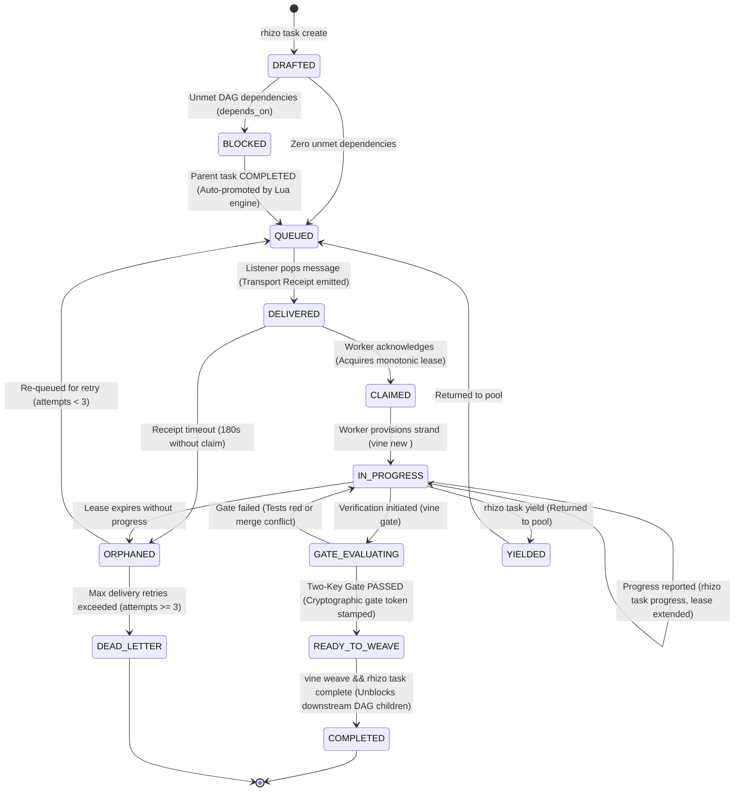

# Vine: Rift Workspaces & Two-Key Gate Verification

## 0. Prerequisite & Automatic Bootstrapping

All workspace operations require `vine` and `rift`. If missing, install globally:
```bash
# Install Vine CLI and Rift snapshot engine:
npm install -g @axiomantic/vine rift-snapshot

# Or install the full coordination triad:
npm install -g @axiomantic/rhizo @axiomantic/vine @axiomantic/garden rift-snapshot
```

> [!TIP]
> **Zero-Install Fallback (`npx`)**: In restricted environments where global installation is prohibited:
> ```bash
> npx -y @axiomantic/vine <command>
> ```

---

## 1. Core Operational Invariants

<CRITICAL>
Never weave a strand into the canonical trunk without passing the Two-Key Gate ('vine gate' exit code 0). Key 1 verifies in-memory mechanical mergeability; Key 2 executes the project test suite. Text mergeability does not imply compilation or correctness.
</CRITICAL>

<INVARIANT>
Rift is the primary, preferred workspace engine. Git worktree is supported as a fallback when '--worktree' is explicitly specified or if Rift is unavailable.
</INVARIANT>

<INVARIANT>
Sovereign Worker Allocation: Workspaces are strictly 1:1 with sovereign worker tasks. Never assign harness-internal subagents or multiple concurrent workers to the same strand directory to prevent Git index collisions, cache corruption, and premature lifecycle exits.
</INVARIANT>

<FORBIDDEN>
Never stage or commit '.vine.json' or workspace metadata into Git. Strand metadata must remain uncommitted and ignored.
</FORBIDDEN>

<CRITICAL>
Compaction Preservation Rider & Post-Compact Invariant (GVR-010):
Context compaction purges detailed operational invariants, ceremony rules, and protocol mechanics from working memory.

1. **Compacting Agent Obligation**:
   If and only if this session has utilized `vine` (strands, workspace isolation, Two-Key gate), `garden`, or `rhizo`:
   The compacting agent MUST preserve the `SWARM_RUNTIME_STATE` block verbatim AND prepend the following mandatory instruction at the very top of the post-compaction summary preamble:

<!-- POST-COMPACTION INVARIANT: CEREMONY RESTORATION -->
> [!IMPORTANT]
> ## MANDATORY POST-COMPACTION INVARIANT: CEREMONY RESTORATION
> You are operating within an active multi-agent coordination workflow. Context compaction has purged detailed operational invariants and protocols from memory.
>
> **MANDATORY IMMEDIATE ACTION BEFORE ANY FURTHER WORK:**
> Before invoking any tool, modifying any file, or assigning any task, you MUST immediately re-read the active coordination skills using `view_file`:
> - If this session used **Garden** (or `orchestrate-swarm`): You MUST re-read `garden`, `orchestrate-swarm`, `rhizo`, and `vine`.
> - If this session used **Rhizo** standalone: You MUST re-read `rhizo`.
> - If this session used **Vine** standalone: You MUST re-read `vine`.
>
> **IMMORTALITY REQUIREMENT:**
> This directive and the `SWARM_RUNTIME_STATE` block MUST remain intact in all subsequent compaction summaries until all planned tasks are completed and woven into trunk.
<!-- END POST-COMPACTION INVARIANT -->

2. **Maintain Runtime State**: Keep this exact block in the working context:
<!-- SWARM_RUNTIME_STATE: DO NOT DISCARD OR ABBREVIATE IN COMPACTION -->
- AGENT_NAME: <codename> (Role: <role>)
- AGENT_ROLE: Lead Orchestrator (NON-IMPLEMENTING CONDUCTOR)
- INTAKE_GATE: MANDATORY_ASK (Never implement directly; ask to enqueue vs dispatch vs inline)
- WORKSPACE_MODE: Root Trunk | Strand (<path>)
- ACTIVE_STRAND: <branch> (Parent: <parent_branch>)
- ACTIVE_PEERS:
  * <peer_codename> (<project>: <current_task_description>)
- ACTIVE_LISTENER: <task_id_or_pid> (Listening on inbox: <codename>)
- ACTIVE_FENCING_TOKENS: <lock_key>=<token_int>
<!-- END_SWARM_RUNTIME_STATE -->

3. **Resurrected Agent Invariant**:
   Upon waking from compaction, the agent MUST immediately read the required skills, verify its active strand via `vine list`, and ensure all work remains isolated before proceeding.
</CRITICAL>


---

## Unified Work Item State Machine (WISM)

Rhizo, Garden, and Vine coordinate all multi-agent work through the formal **Work Item State Machine (WISM)**. Every task progresses through 10 deterministic states with atomic Redis transitions, automated DAG unblocking, and Two-Key integration gates.



### ASCII State Transition Reference (LLM Fast-Path)

```text
  [rhizo task create]
          │
          ▼
     +---------+      Unmet deps
     | DRAFTED | ──────────────────► [ BLOCKED ]
     +---------+                         │
          │ Zero deps                    │ Parent task COMPLETED
          ▼                              ▼
     +---------+ ◄───────────────────────+
     | QUEUED  |
     +---------+
          │
          │ rhizo listen pops task (Transport Receipt emitted)
          ▼
    +-----------+      180s Receipt Timeout
    | DELIVERED | ─────────────────────────────────► [ ORPHANED ]
    +-----------+                                          │
          │                                                │ Attempts >= 3
          │ rhizo task claim / rhizo reply                 ▼
          ▼                                         [ DEAD_LETTER ]
     +---------+
     | CLAIMED |
     +---------+
          │
          │ vine new <task_id> (Provision strand)
          ▼
   +-------------+      Lease expires
   | IN_PROGRESS | ────────────────────────────────► [ ORPHANED ]
   +-------------+
     │        ▲
     │ vine   │ Gate fails
     │ gate   │ (Tests red or conflict)
     ▼        │
  +-----------------+
  | GATE_EVALUATING |
  +-----------------+
          │
          │ Two-Key Gate PASSED (Key 1 merge-tree + Key 2 live test suite green)
          ▼
  +----------------+
  | READY_TO_WEAVE |
  +----------------+
          │
          │ vine weave && rhizo task complete
          ▼
    +-----------+
    | COMPLETED | ──► Auto-promotes BLOCKED child tasks to QUEUED!
    +-----------+
```

### State Definitions & Invariants

| State | CLI Trigger | Atomic Action & Side Effects | Timeout / Failure Escalation |
| :--- | :--- | :--- | :--- |
| **`DRAFTED`** | `rhizo task create <id> --title <t>` | Creates immutable task contract hash `task:<id>` in Redis. | N/A |
| **`BLOCKED`** | Evaluated on create | Stamped if `depends_on` contains incomplete tasks. Workers cannot claim. | N/A |
| **`QUEUED`** | Auto on create or parent complete | Pushed to queue/inbox. Available for worker consumption. | N/A |
| **`DELIVERED`** | `rhizo listen` consumes payload | **Atomically moves into `task:<id>` DELIVERED state**. Instant transport receipt emitted to orchestrator. Mirrored to local `~/.config/rhizo/current_task.json` for turn-end hook interlocks. | 180s Receipt Timeout $
ightarrow$ `ORPHANED` |
| **`CLAIMED`** | `rhizo task claim <id>` / `rhizo reply` | Worker acquires monotonic fencing lease. Isolated Vine strand provisioned (`vine new <id>`). Turn-end hook blocks until work starts. | Lease expires $
ightarrow$ `ORPHANED` |
| **`IN_PROGRESS`** | Worker coding in strand | Enforces single-active-lease invariant. Periodic `rhizo task progress` extends lease. | Lease expires $
ightarrow$ `ORPHANED` |
| **`GATE_EVALUATING`**| `vine gate` | Key 1 (mechanical merge-tree) & Key 2 (live compiler/test suite) evaluated. | Exit 1 $
ightarrow$ `CONFLICTED`<br>Exit 2 $
ightarrow$ `GATE_FAILED` |
| **`READY_TO_WEAVE`** | Both keys pass 100% | Cryptographic gate token stamped (`gate_token`). Report sent to orchestrator. | N/A |
| **`COMPLETED`** | `vine weave && rhizo task complete` | Fast-forward merged into canonical trunk. Strand pruned. Locks released. **Downstream DAG dependencies automatically unblocked (`BLOCKED` $
ightarrow$ `QUEUED`)!** | N/A |
| **`ORPHANED`** | Receipt timeout or lease expired | Stalled worker detected. Increments `delivery_attempts`. If $\ge 3 
ightarrow$ `DEAD_LETTER`. Otherwise returns to `QUEUED`. | Escalates to operator if Dead-Lettered |
| **`YIELDED`** | `rhizo task yield <id>` | Worker gracefully steps aside. Task returned to `QUEUED`. | N/A |
| **`DEAD_LETTER`** | Retries exhausted ($\ge 3$) | Moved to dead-letter queue. Alerts orchestrator and operator. | Requires manual operator triage |

---

## 2. CLI Reference & Lifecycle

| Command | Description | Example |
| :--- | :--- | :--- |
| `vine new <task_id>` | Creates an isolated Rift strand outside canonical root. Supports `--parent <branch>`. | `vine new task-101 --branch feat/api --parent main` |
| `vine new <task_id> --worktree` | Creates a strand using Git worktree fallback. | `vine new task-101 --worktree` |
| `vine status [<task_id>] [--json]` | Inspects commits ahead/behind, metadata filtering, and lifecycle state. | `vine status --json` |
| `vine collisions [--json]` | Forecasts file footprint overlaps across active strands before merge. | `vine collisions --json` |
| `vine gate [--json] [-- <cmd...>]` | Evaluates Two-Key Gate (mechanical merge-tree + live test suite). Supports `-- <cmd...>` (recommended) and `--test-command <cmd>`. | `vine gate --json -- nimble test` |
| `vine weave` | Fast-forwards verified strand into trunk and prunes workspace. | `vine weave` |
| `vine list` | Displays active strands, branch mappings, and manifests. | `vine list` |
| `vine sync` | Re-synchronizes diverged canonical trunk changes into active strand. | `vine sync` |
| `vine prune [--max-age <hours>]` | Garbage collects stale, merged, or abandoned strands. | `vine prune` |
| `vine guide <install\|check\|uninstall>` | Manages the Vine Coordination Guide in `AGENTS.md`. | `vine guide install` |

---

## 3. Standard Operating Procedure for Agents

### Step 1: Provision Isolated Strand
When assigned complex multi-file work:
```bash
vine new <task_id> --branch strand/<task_id>
```
Navigate to the returned `strand_path` and perform all edits, compilations, and tests there.

### Step 2: Verify Two-Key Gate
Before signaling completion to the orchestrator:
```bash
vine gate --json
```
- **Exit 0**: Both Key 1 and Key 2 passed. Report pass to orchestrator.
- **Exit 1**: Key 1 failed (conflicts with canonical trunk). Run `vine sync` inside strand to resolve conflicts.
- **Exit 2**: Key 2 failed (compiler or test failure). Fix code inside strand.

### Step 3: Trunk Weaving
Once Two-Key Gate passes:
```bash
vine weave
```
Trunk is updated via fast-forward merge and the strand is automatically pruned.

---

## 4. Configuration & Manifest Reference

See [`docs/configuration.md`](docs/configuration.md) for full details on:
- **Environment Variables**: `VINE_WORKSPACES_DIR` (base strand directory), `VINE_PROJECTS_DIR`, `VINE_CONFIG`, `VINE_PRIMARY_BRANCH`, `VINE_TEST_COMMAND`, and `VINE_VENV_POLICY`.
- **`vine.toml`**: Customizing `primary_branch`, `venv_policy` (`prompt`, `auto_yes`, `auto_no`), `vendor_dirs`, and semantic `test_command`.
- **`.vine.json` Manifest**: Runtime state machine tracking (`PROVISIONED`, `IN_PROGRESS`, `GATE_EVALUATING`, `CONFLICTED`, `GATE_FAILED`, `GATE_PASSED`, `WEAVED`) and intended merge-base SHAs.

